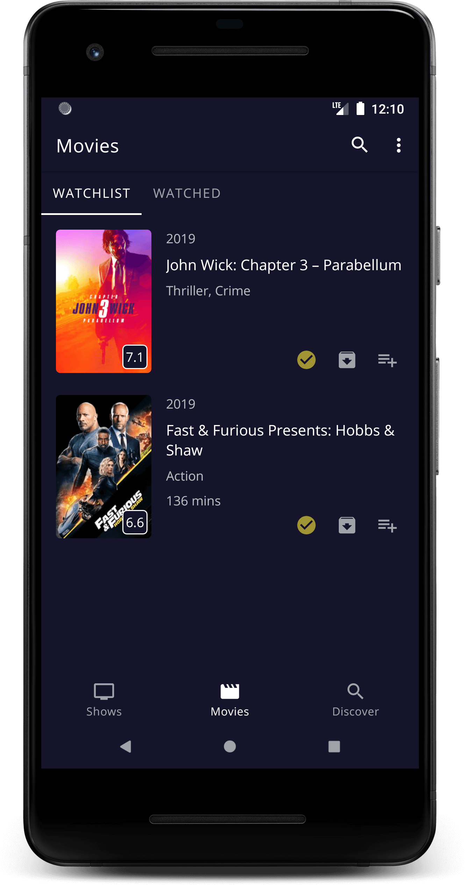

# UpNext App for Android

An Android app to track your favourite movies and TV shows.



## Getting Started
To run the app, you will need to add your own [TMDB API key](https://www.themoviedb.org/documentation/api) 
to the project as a property in your local `gradle.properties` file in the format:
```
tmdb_api_key="your_api_key"
```

## Features
- Browse movies and TV shows and add them to your watchlist, custom lists and mark them as 'watched'.
- No sign-in required.
- Works offline via caching, including past searches.

## Backlog
The project backlog is currently split into phases:
1. [Alpha](https://github.com/DarrenAtherton49/UpNext/projects/3)
2. [Beta](https://github.com/DarrenAtherton49/UpNext/projects/5)
3. [1.0 Release](https://github.com/DarrenAtherton49/UpNext/projects/6)
4. [Extra Features](https://github.com/DarrenAtherton49/UpNext/projects/7)
5. [Testing](https://github.com/DarrenAtherton49/UpNext/projects/4)

NOTE: 
- Each time an item in the backlog is completed, it should be written down as a feature if appropriate.
- Each time a dependency is added to the project, it must also be added to `LicensesList.kt`

## Licence
```
Copyright 2019 Darren Atherton

Licensed under the Apache License, Version 2.0 (the "License");
you may not use this file except in compliance with the License.
You may obtain a copy of the License at

   http://www.apache.org/licenses/LICENSE-2.0

Unless required by applicable law or agreed to in writing, software
distributed under the License is distributed on an "AS IS" BASIS,
WITHOUT WARRANTIES OR CONDITIONS OF ANY KIND, either express or implied.
See the License for the specific language governing permissions and
limitations under the License.
```
